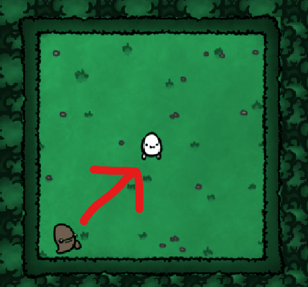

this is the game Diary here i will put down the stuff that i go through my developing journey.

20/08/2023
i have found few tutorials on how to set up the workspace for the Unity program and i am learning what does what with unity atm. i am downloading few free artpacks to test.
i have started creating the background of the game with an art package. the art package i have used is this https://thomasgvd.itch.io/top-down-shooter. i have learned how to add animations so added the idle animation to the main character, i have also added a few components to the main character such as Rigidbody 2D and Box Collider 2D. this RigidBody2D components applies the rules of the physics engine to the main character. (example of this could be the applied gravity on the character.) and BoxCallider2D component detects the collisions of the objects in game(example of this is bullet hitting the enemies and so on).

i have mostly created animations and set up the art work for the game i will start coding the scripts tomorrow. and i also have to find a way to connect the python code that does the eye-movement-tracker with the C# on unity apperantly there are many ways but the one that i found most interesting is a plugin called Python for Unity. (https://docs.unity3d.com/Packages/com.unity.scripting.python@2.0/manual/index.html)

here is how my game is comming together at the moment:

22/08/2023
i have started coding the coding part of the game, though the only problem is that i dont know C# to detailed, which causes me to do some reasearch as i go. I have started with the enemy movements and its animations. since that part would be the more complicated part, our main character won't have the ability to move because there wont be any other input entries. the enemies will be randomized on the field coming towards our main character(the enemies wont carry a weapon, they are more like zombies).

created the enemy_controller script where we initialize the characteristics of the enemy. the way how the enemies work is they move towards to the main character. so to begin with we need to create a variable that takes the postion of main character. there was a method in unity that finds GameObjects by its tag, in Unity 2D's UI we have specified the tag of our character as "Player", and used the Transform component that provides the position, rotation and scale of that GameObject. here is the line that helped me achieve all this:  

playerPos = GameObject.FindGameObjectWithTag("Player").GetComponent<Transform>();

now that i have the players position i can make the enemy move towards to the main character, to achieve this i updated the position of the enemy repeadetly. There was an in built method MoveTowards(current_position, destination_position, speed) that took the current position of the enemy, the destination position(characters position) and the speed it will move which was specified on Unity2D's UI. Anyway here is the actual line of code that helped me achieve this:

transform.position = Vector2.MoveTowards(transform.position, playerPos.position, speed * Time.deltaTime);

this is what we have atm 

now it is time to make the enemy spawn randomly!