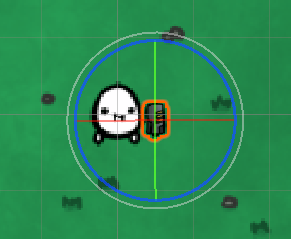
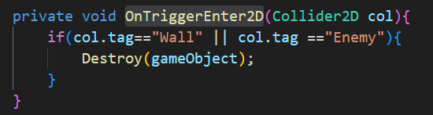
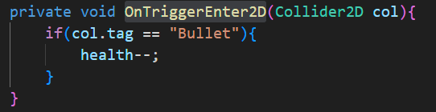
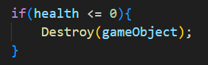

this is the game Diary here i will put down the stuff that i go through my developing journey.

20/08/2023
i have found few tutorials on how to set up the workspace for the Unity program and i am learning what does what with unity atm. i am downloading few free artpacks to test.
i have started creating the background of the game with an art package. the art package i have used is this https://thomasgvd.itch.io/top-down-shooter. i have learned how to add animations so added the idle animation to the main character, i have also added a few components to the main character such as Rigidbody 2D and Box Collider 2D. this RigidBody2D components applies the rules of the physics engine to the main character. (example of this could be the applied gravity on the character.) and BoxCallider2D component detects the collisions of the objects in game(example of this is bullet hitting the enemies and so on).

i have mostly created animations and set up the art work for the game i will start coding the scripts tomorrow. and i also have to find a way to connect the python code that does the eye-movement-tracker with the C# on unity apperantly there are many ways but the one that i found most interesting is a plugin called Python for Unity. (https://docs.unity3d.com/Packages/com.unity.scripting.python@2.0/manual/index.html)

here is how my game is comming together at the moment:

22/08/2023
i have started coding the coding part of the game, though the only problem is that i dont know C# to detailed, which causes me to do some reasearch as i go. I have started with the enemy movements and its animations. since that part would be the more complicated part, our main character won't have the ability to move because there wont be any other input entries. the enemies will be randomized on the field coming towards our main character(the enemies wont carry a weapon, they are more like zombies).

created the enemy_controller script where we initialize the characteristics of the enemy. the way how the enemies work is they move towards to the main character. so to begin with we need to create a variable that takes the postion of main character. there was a method in unity that finds GameObjects by its tag, in Unity 2D's UI we have specified the tag of our character as "Player", and used the Transform component that provides the position, rotation and scale of that GameObject. here is the line that helped me achieve all this:  

playerPos = GameObject.FindGameObjectWithTag("Player").GetComponent<Transform>();

now that i have the players position i can make the enemy move towards to the main character, to achieve this i updated the position of the enemy repeadetly. There was an in built method MoveTowards(current_position, destination_position, speed) that took the current position of the enemy, the destination position(characters position) and the speed it will move which was specified on Unity2D's UI. Anyway here is the actual line of code that helped me achieve this:

transform.position = Vector2.MoveTowards(transform.position, playerPos.position, speed * Time.deltaTime);

this is what we have atm 

23/08/2023
to create randomly spawning enemies i would have to reuse the enemy GameObject, aperantly there is something called Prefabs in Unity2D, this Prefab component allows me to reuse GameObjects over and over again when it is needed.

i have initialized many spawnpoints which surrounds all around the map (total of 41 spawners). this is how it looks:  all the shown red diamonds are the spawning points of the enemies and they are triggered randomly.
To triger these points randomly to spawn enemies, i wrote a spawn() method which chooses a random spawner to make the enemy spawn in that random number spawner, and after the random spawner is set, Instantiate inbuilt method will create the enemyPrefab in the randomly chosen spawn point.

int randomPosition =  Random.Range(0, spawnerPoints.Length); 
(this line will output a number between 0 and the amount of spawnerPoints which is 41.)

GameObject newEnemy = Instantiate(enemyPrefab, spawnerPoints[randomPosition].position, Quaternion.identity); (this line will create the enemyPrefab object in the randomly chosen spawn.point.)

after the spawning method is finished we need to keep calling this spawn() method repeadetly. Unity2D provides a method thats called InvokeRepeating("function",first_time_call, interval) that takes in the function name that we want to repeat, the first time when it will be called and the repeat rate of the function as parameters. this is the line of code that is used:

InvokeRepeating("spawn",0.1f, interval); (calling spawn method for the first time in 0.1f and it will repeat it with the rate of interval variable which is initialized in the Unity2D UI which is 3.0)

the enemy spawning times could be played around later on to make the perfect gameplay

24/08/2023
i have rescaled the game map and the characters. here is how it looks now . my plan is to add the shooting feature and enemies death after getting shot at, and maybe add an main menu to make it look more like an app.

the main character now has a weapon that can shoot, the direction of the weapon follows the cursor, however implementing this feature was a little more challanging that i thought. 

to get the mouse position on to the game i have used an inbult method called ScreenToWorldPoint() which transforms a point from screen to game space.
inside this method Vector3 is used to get the current position of the mouse on the screen space. As a result of this method a new Vector3 will be returned showing the new game space position of the mouse. down below is the code that was created 

mousePosition = Camera.main.ScreenToWorldPoint(new Vector3(Input.mousePosition.x, Input.mousePosition.y, transform.position.z));

NOTE:(Vector3 has 3 arguments which are X,Y and Z axis. However since our game is 2D we only require the first two parameters which are X and Y Axis, so we just use the default Z value.)

we later assign this new game space position to our crosshair so that the crosshair follows the cursor. here is that line of code:

cross.transform.position = new Vector3(mousePosition.x, mousePosition.y, transform.position.z);

the gun also requires to rotate depending on the direction of the mouses postion, so i created an simple calculation where i have subracted the position of the weapon from the current position of the mouse in game space, and used the  transform.right to move the direction of the gun to the mouse point. this  transform.right moves the X axis(The red arrow) of the of the gun considering its rotation.(https://docs.unity3d.com/ScriptReference/Transform-right.html#:~:text=right%2C%20Transform.,red%20arrow's%20axis%20(X).) REFERANCE

here is an example of how it works:
 ->  ->  -> 

here is a better visual explanation  in this case the coordinate of the mouse will be (7,2) and the coordinate of the gun is (0,0)

(in this game the character does not move so the gun always stays in the same position(0,0) which mean that only the position of the Mouse is enough to get the required coordinates, i could also just remove the calculations but i still left it in there just incase in the future i want to move the character as well. than these calculations will be needed.)

here is the code that does the rotating:

Vector2 targetDirection = new Vector2(mousePosition.x - transform.position.x, mousePosition.y - transform.position.y);

transform.right = targetDirection;

the way how the shooting works is by inputing a left-click with our mouse (in future muse headband jaw clench.) so a simple statement was done to check if a left-click input was done, if so it would triger the shoot(); method which instantiates the prefab bullet.

NOTE_TO_ME: put down the code down here in report.

next i will be creating the bullet features. i did created the bullet but the created bullet does not function that well. also need to create the enemy health stuff. 

25/04/2023
the current bullet features have no movement at all, they are created but they are not going anywhere. to implement the features of the bullets i have created a controller(Bullet_Controller). 

so to make the bullets move i could use the inbuilt method MoveTowards(); which we have used before when creating enemies, but this time the bullets needs to go towards where the Mouse will be at. So to get the move position in game space ive  used ScreenToWorldPoint(); in built method which i used before during implementing the Gun. here is that line of code:

target = Camera.main.ScreenToWorldPoint(Input.mousePosition); (gets the mouse point on screen and transfroms it to game space)

now that the position of the mouse is initialized in the variable "target" this variable will be used in the MoveTowards(); method. here is what the code looks like. this method will make the bullet move from its current position to the where the mouse was clicked at.

transform.position = Vector2.MoveTowards(transform.position, target, speed * Time.deltaTime); (the bullet move from its current position to the where the mouse was clicked on the game space, the bullet will move in the given speed, which was given on the Unity2D UI and in this case it is 5)

however now a different issue we are against is that the bullet dont dissappear after they are shot, they go to the point where they were expected but they dont dissapear so i used the Destroy(object,time); method to destroy the gameObject which is the bullet in 2.0f time. here is the line of code:

Destroy(gameObject, 2.0f);

now the bullet disappears 2 seconds after it is shot, but still they can go over board the map or don't disappear after hitting an enemy. i did some research and apperantly there is an Function that Unity2D provides which is the OnTriggerEnter2D(Collider2D col). to use this function properly i had to learn about trigger objects. Trigger objects are enabled from the BoxCollider2D component, these objects are able to check the collisions but they require the OnTriggerEnter2D(); function. if this function is not used it will just go through the object. 

inside this OnTriggerEnter2D(); function is an if statement that checks if the GameObject bullet collides with other GameObjects that has the tag of "Wall" or "Enemy" it will destroy the bullet. here is that OnTriggerEnter2D(); function:

the tags for these where created and applied in Unity2D Components section.

another important thing about trigger object is that trigger events only works when one of the colliding GameObject have the Rigidbody2D Component.(both can have it if it is necessary, in my case the Enemy and the bullets require to have the Rigidbody2D because they are required to have the physics applied on them inorder to function properly, but the walls do not have this component, and they function the same.)

i have also implemented health functionality to the enemies. before the enemies would not die when they got shot, but now they disappear when they get shot once(the enemy health can change). to achieve this, first i initialized the health of the enemies to an integer value (which is 1), next thing was to detect the collition of the bullets with the enemies, i have also implemented this using the trigger objects with OnTriggerEnter2D(); function with an if statement inside, this time when the enemies were hit by a bullet their health would decrease by one. here is how the OnTriggerEnter2D(); function looks like for Enemies:

however after the enemies health is zero they need to disappear so i made another if statement in the Update function.

IMPORTANT: since the Python code we have written before helps us use the mouse with our eyes all of the inputs in this game will be provided with our eyes.

